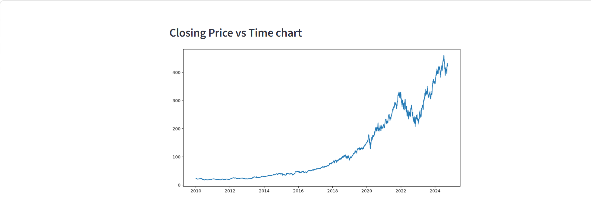
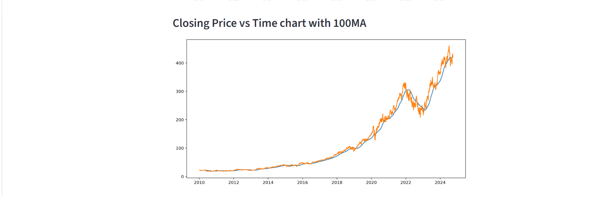
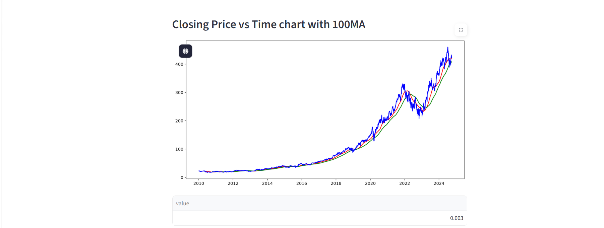
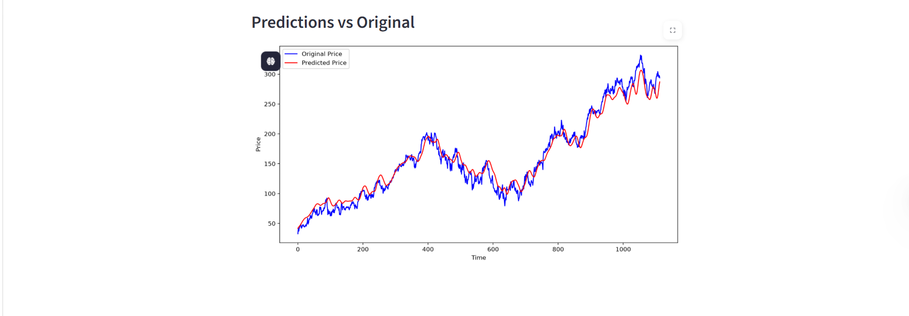

# 📈 Stock Market Analysis and Prediction with TensorFlow

<p align="center">


</p>

<p align="center">
An AI-powered stock market analysis and prediction application that uses TensorFlow LSTM models to analyze historical stock prices, visualize market trends, and forecast future stock movements.
</p>

---

# 📖 Project Overview

The **Stock Market Analysis and Prediction** system uses **Deep Learning (LSTM)** to analyze historical stock market data and predict future closing prices.

The application allows users to:

- 📊 Analyze historical stock performance
- 📈 Visualize stock trends
- 🧠 Predict future closing prices using TensorFlow
- 📉 Compare predicted prices with actual prices
- 📋 Explore descriptive statistics for selected stocks

The project demonstrates how Artificial Intelligence and Deep Learning can be applied to financial time-series forecasting.

---

# ✨ Features

- 📊 Historical Stock Data Analysis
- 📈 Interactive Closing Price Charts
- 📉 Moving Average (100 MA & 200 MA) Visualization
- 🤖 TensorFlow LSTM Prediction Model
- 📋 Stock Summary Statistics
- 📊 Original vs Predicted Price Comparison
- ⚡ User-friendly Streamlit Interface

---

# 🎯 Objectives

- Analyze historical stock market trends
- Predict future stock prices using Deep Learning
- Visualize technical indicators
- Compare model predictions with actual prices
- Assist users in understanding stock market behavior

---

# ⚙️ Modules

### 📋 Stock Selection

- Select stock ticker
- Load historical stock data
- Display descriptive statistics

### 📈 Historical Analysis

- Closing Price vs Time
- Moving Average Analysis
- Trend Visualization

### 🤖 Prediction Module

- TensorFlow LSTM Model
- Future Price Prediction
- Original vs Predicted Comparison

---

# 🛠️ Tech Stack

## Programming Language

- Python

## Machine Learning

- TensorFlow
- Keras

## Data Processing

- Pandas
- NumPy

## Data Visualization

- Matplotlib
- Plotly

## Data Source

- yFinance API

## Framework

- Streamlit

## Version Control

- Git
- GitHub

---

# 📂 Project Structure

```text
Stock-Market-Prediction/
│
├── model/
├── data/
├── notebooks/
├── Screenshots/
│   ├── Stock table.png
│   ├── Chart-1.png
│   ├── Chart-2.png
│   ├── Chart-3.png
│   └── chart-4.png
│
├── app.py
├── requirements.txt
└── README.md
```

---

# 📸 Application Screenshots

## 📊 Historical Stock Data

<p align="center">

</p>

The dashboard displays:

- Stock selection
- Historical dataset
- Statistical summary
- Data from 2010–2024

---

## 📈 Closing Price vs Time

<p align="center">

</p>

Visualizes the stock's closing price trend across multiple years, helping users identify long-term growth and market fluctuations.

---

## 📉 Closing Price with 100-Day Moving Average

<p align="center">

</p>

Shows the stock's closing price alongside the **100-Day Moving Average**, making it easier to observe short-term trends.

---

## 📊 Closing Price with 100-Day & 200-Day Moving Averages

<p align="center">

</p>

Compares:

- Original Closing Price
- 100-Day Moving Average
- 200-Day Moving Average

These indicators help identify bullish and bearish market trends.

---

## 🤖 Original vs Predicted Prices

<p align="center">

</p>

Displays the comparison between:

- Original Stock Prices
- TensorFlow Predicted Prices

This visualization helps evaluate the performance of the trained LSTM model.

---

# 🧠 Machine Learning Workflow

```text
Historical Stock Data
          │
          ▼
 Data Cleaning & Preprocessing
          │
          ▼
 Feature Scaling (MinMaxScaler)
          │
          ▼
 LSTM Model Training
          │
          ▼
 Stock Price Prediction
          │
          ▼
 Performance Evaluation
          │
          ▼
 Visualization
```

---

# 🚀 Installation

## Clone Repository

```bash
git clone https://github.com/bhargavi4470/Stock-Market-Analysis-and-Prediction.git

cd Stock-Market-Analysis-and-Prediction
```

---

## Install Dependencies

```bash
pip install -r requirements.txt
```

---

## Run the Application

```bash
streamlit run app.py
```

---

# 📊 Machine Learning Techniques

- Long Short-Term Memory (LSTM)
- Time Series Forecasting
- MinMax Scaling
- Sequential Neural Networks
- Historical Trend Analysis

---

# 🚀 Future Enhancements

- 📈 Multi-stock comparison
- 📰 Real-time financial news integration
- 📱 Mobile-friendly dashboard
- ☁️ Cloud deployment
- 📊 Candlestick charts
- 🔔 Price alert notifications
- 🤖 Sentiment analysis using news headlines

---

# 👩‍💻 Developed By

**Mangam Sai Ram Bhargavi**

**GitHub:**  
https://github.com/bhargavi4470


---

# ⭐ Support

If you found this project useful, consider giving it a ⭐ on GitHub.

Your support motivates future improvements and open-source contributions.

---
